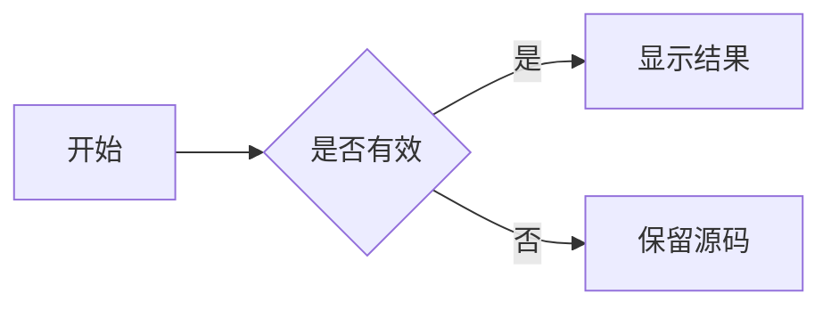
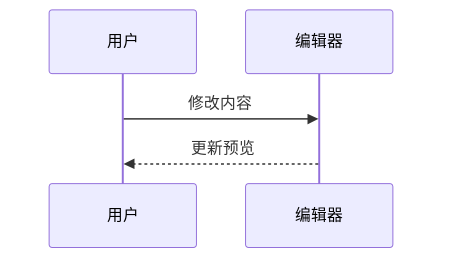

# 数学公式与 Mermaid 验收样例

行内公式：能量 $E = mc^2$，分式 $\frac{a+b}{c}$，根式 $\sqrt{x^2+y^2}$。公式前后的中文应紧邻正常排版，换行时公式保持完整。

## 展示公式

$$
\frac{-b \pm \sqrt{b^2 - 4ac}}{2a}
$$

$$
\begin{pmatrix} a & b \\ c & d \end{pmatrix}
$$

公式下方的普通段落不应被遮挡。

## 流程图



## 时序图



## 表格与引用

| 名称 | 公式 |
| --- | --- |
| 平方 | $x^2$ |
| 分式 | $\frac{1}{2}$ |

> 引用中的公式 $a^2+b^2=c^2$。

- 列表中的公式 $\sum_{i=1}^{n} i$。

## 字面量与错误回退

行内代码 `$x^2$` 和转义美元符号 \$ 保持原样。

```rust
// $x^2$ 与 $$y$$ 不应在普通代码块中渲染
```

错误公式 $\notARealCommand{x}$ 应保留可编辑源码。

```mermaid
this is not a supported diagram
```

手工检查：点击公式/图表进入源码编辑，离开恢复渲染；修改后撤销；窄窗口换行；滚动出入视口；切换主题与字号。
