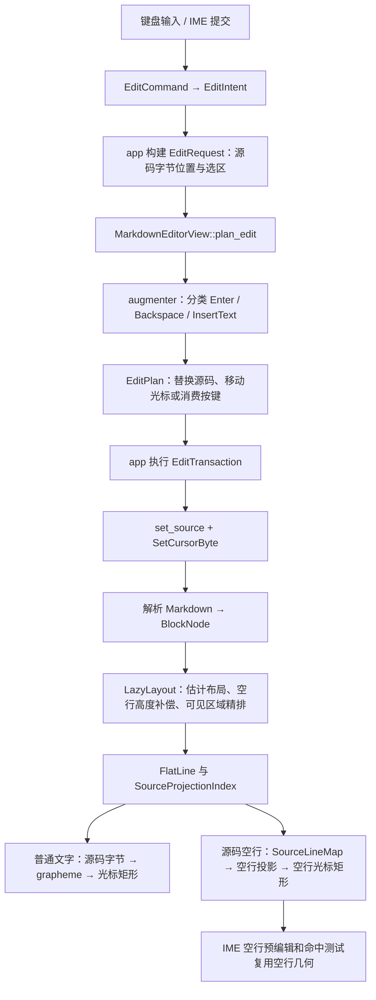

# Markdown WYSIWYG 输入、空行和块间距链路审查

审查日期：2026-09-06。代码基线：`daa399e`。本次范围为分析与失败复现，没有修改生产行为。

## 结论

已通过真实编辑增强、源码替换和编辑器重排复现五类缺陷。共同问题是：编辑器把空段落表达成源码空行，排版却只布局解析出的非空块，随后再从相邻文字矩形反推空行的位置和样式。空行变成文字段落时，两条排版路径不能保持相同几何。

分割线遗漏是其中一处；仅落实 9 月 3 日的原子块设计，不能解决标题、代码块、表格、引用和 Backspace 的其他缺陷。

优先级均为 P2（常见编辑行为的正确性问题），建议按下述依赖分阶段修复。

## 1. 当前链路



关键位置：

| 阶段 | 代码 |
|---|---|
| 按键语义、事务执行 | `crates/app/src/edit_transaction.rs:105`、`crates/app/src/dispatch/editor.rs:725` |
| 中文输入提交 | `crates/app/src/app_lifecycle.rs:587`，最终进入 `InsertText` |
| 插件编辑计划与选区处理 | `crates/markdown/src/view.rs:2901` |
| 结构化输入增强 | `crates/markdown/src/augmenter.rs:41`、`:1164` |
| 源码更新、布局重建 | `crates/markdown/src/view.rs:2755`、`:561`、`:3032` |
| 空行高度预留 | `crates/markdown/src/layout/types.rs:1412` |
| 空行分类和垂直定位 | `crates/markdown/src/layout/source_line_map.rs:137`、`:237` |
| 普通光标与空光标分流 | `crates/markdown/src/view.rs:1235`、`:1448` |
| 空行字号、缩进 | `crates/markdown/src/view.rs:1545` |
| IME 空行预编辑 | `crates/markdown/src/view.rs:1377` |
| 点击到源码 | `crates/markdown/src/view.rs:1717` |

源码字节位置是编辑侧事实源。源码变化触发解析和布局重建；精确 shaping 仍按视口进行，并非每次都全文精排。光标移动本身还会展开或收起 Markdown 标记，触发受影响块重排。

## 2. 不同元素的现有换行语义

| 光标上下文 | Enter | Backspace 主要路径 |
|---|---|---|
| 普通段落中间 | 通常插入两个换行，拆成两个段落；保留跨拆分处的行内样式 | 段首删除段边界，合并前一可合并块 |
| 段落末尾且下方已有块分隔 | 补一个源码换行，光标跨到新可编辑空行 | 空行删除分支 |
| 已有空行 | 插入一个源码换行 | 中间空行与文末空行采用不同落点算法 |
| ATX 标题 | 中间拆出普通段落；末尾创建空段落 | 标记边界保护；后续段首可以合并回标题 |
| Setext 标题 | 在下划线后建立段边界 | 防止把后文直接拼到不可合并叶块 |
| 列表 | 续项、续编号或创建未完成 task；空项逐层退出 | 标记删除、续行合并、容器边界处理 |
| 引用 | 续引用前缀；空引用逐层退出 | 引用标记删除、硬换行合并 |
| 围栏代码块 | 内容内为源码换行；开启/闭合围栏有专门处理 | 代码内普通编辑；块外保护围栏边界 |
| 表格 | 同列下一行、追加行或退出空行 | 不可合并叶块边界保护 |
| 分割线 | 没有独立 EnterContext，源码态落入默认行为 | 后续段首的不可合并叶块保护 |

Shift+Enter 另有硬换行路径：普通段落及容器使用反斜杠换行；标题、表格使用 `<br>`；代码块使用源码换行。因此「软折行」「源码换行」「新段落」「隐藏分隔行」不能混为一个行高操作。

`SourceLineMap` 将块间第一个空源码行作为隐藏分隔符，后续空行作为可编辑空段落。默认测试样式中，一份可编辑空段落高度为 `24px 行高 + 12px 段间距 = 36px`。源文本中的单个空行不是独立可编辑行。

## 3. 实测矩阵

夹具采用 `前段\n\n后继块`，在“前段”末尾 Enter，然后输入“新”，再 Backspace 删除最后一个字。每一步应用真实 `EditAugmentation` 并更新同一 `MarkdownEditorView`，使用真实 Shaper 重排。

下表为光标顶边的文档坐标，单位是物理像素。1× DPI、正文字号 15、行高 24，视口 800×1600；删除后的源码和字节落点均回到 Enter 后状态。

| 后继块 | Enter 后空光标 y | 输入“新”后 y | 删回空行 y | 输入时向上跳动 | 2× DPI 跳动 |
|---|---:|---:|---:|---:|---:|
| 普通段落 | 39 | 39 | 39 | 0 | 0 |
| 分割线，后有段落 | 65 | 39 | 65 | 26 | 26 |
| 分割线，位于文末 | 51 | 39 | 51 | 12 | 24 |
| H2 标题 | 46.2 | 39 | 46.2 | 7.2 | 14.4 |
| 引用 | 84.75 | 39 | 84.75 | 45.75 | 91.5 |
| 普通列表 | 39 | 39 | 39 | 0 | 0 |
| 围栏代码块 | 49.8 | 39 | 49.8 | 10.8 | 21.6 |
| 表格 | 46.5 | 39 | 46.5 | 7.5 | 15 |

普通段落和列表只是本矩阵的对照项通过，不能据此推断所有列表嵌套和换行组合都正确。分割线高度在本夹具的两个 DPI 下均为 26px，与样式中 rule 参数直接取主题值有关；本报告不把它另列为 DPI 产品缺陷。

## 4. 五个根因

### A. 分割线没有进入源码行几何输入

位置：`layout/types.rs:326`，`collect_source_only_empty_line_projections`。

函数使用 `line.source_projection.as_ref()?` 过滤布局行。分割线拥有 `atomic_source_range`，没有文字 `source_projection`，因此被丢弃。`SourceLineMap` 计算分割线之前的空行时看到的是分割线之后的文字行；分割线位于文末时则走无后继文字行的路径。两种情况产生不同偏差。

实测 `前段\n\n\n---\n\ntail` 中，分割线矩形为 y=72、h=26，空光标 y=65、h=15，已经侵入分割线的布局区域；输入后光标回到 y=39。不能笼统描述成所有夹具都会在分割线下方，具体越界方向取决于样式、DPI 和邻接内容。

9 月 3 日的原子块空行设计确实覆盖此根因，但截至本次基线只有设计与计划，生产代码未接入。让原子块源码范围参与 `RenderedLineLayout` 是必要修复；不应为此伪造 grapheme 投影。

### B. 从下一条文字行反推空行，会把下一块的专属间距搬到空行上方

位置：`layout/source_line_map.rs:260` 附近的 `classify_blank_line`。

当前计算：

```text
real_gap = next_text_line.y - previous_content_bottom
separator_height = max(real_gap - editable_count × (line_height + paragraph_spacing), 0)
empty_line.y = previous_content_bottom + separator_height
```

`real_gap` 同时含有块间距、标题入口间距、代码块 padding 和表格单元格 padding。减去空段落预留量后，算法把全部剩余量算成空行的前置分隔间距；输入文字后，普通段落却按前一段落的 trailing spacing 排在 y=36，其后的标题入口间距或代码 padding 留在后继块内部。

实测 H2 的偏差 7.2px 对应标题额外入口间距，代码的 10.8px 对应代码 padding，表格的 7.5px 对应单元格 padding。说明当前输入缺少「块外边界」与「块内首条文字行」的区别。

仅保证空行“不重叠下一条文字行”不足以检出此问题；必须要求同一位置从空行变成普通文字后保持原槽位。

### C. 引用前同一串空行被顶层和子块两次补偿

位置：`layout/types.rs:1412`；`layout/block.rs:269`、`:554`；`layout/context.rs:447`。

顶层 `reserve_extra_blank_source_lines` 已按引用块前面的空行增加 `y_delta`。引用块排其首个段落子块时，又调用 `reserve_nested_blank_source_lines`，该函数从子块起点所在源码行向前扫描，跨过容器边界，数到同一串外部空行。

`compensated_blank_run_line_starts` 仅在 `LayoutCtx` 内去重，顶层 `LazyLayout` 的补偿没有登记到这套状态，无法阻止这次重复。

独立断言实测：

```text
前段\n\n> tail      → 引用文字 y=45.75
前段\n\n\n> tail    → 引用文字 y=117.75
实际增高 72px，期望 36px
```

因此矩阵中引用的 45.75px 跳变 = 重复补偿 36px + 引用顶部 padding 9.75px。这里还会导致输入首字时后继引用整体收缩，不能只修光标 y。

### D. 空段落沿用前一个块的字号、缩进和行高

位置：`view.rs:1545`，`empty_source_line_typography`；回退邻接查询 `view.rs:1582`。

只要存在前一条文字行，函数就返回它的 `rect.x`、`font_size`、`rect.h`。但本次测试里的空行语义是容器外的普通段落，输入后应使用正文样式。

实测前块加 `\n\n\n后段`，在可编辑空行输入“新”：

| 前块 | 空光标 x / 高度 | 输入后正文行 x / 光标高度 |
|---|---|---|
| H1 | 0 / 27 | 0 / 15 |
| 代码块 | 10.8 / 13.5 | 0 / 15 |
| 引用 | 9.75 / 13.5 | 0 / 15 |
| 列表 | 30 / 15 | 0 / 15 |

这解释了“在这里看到光标，输入文字却出现在左边”的横向错位，以及标题后空光标过高。容器内部的空内容当然需要容器缩进，但应由空行的语义归属决定，不能一律继承前一条文字行。

空行 IME 预编辑也调用 `empty_source_line_metrics`，所以从静态调用链看会共享这些坐标和字号问题；本次没有运行真实中文输入法 UI，不能将其描述成已完成的 IME 端到端复现。

### E. 中间空行 Backspace 删除一行，却跳过整个空行串

位置：`augmenter.rs:850`，`backspace_empty_source_line`。

非文末分支只删除当前空行的一个换行序列，但将 `cursor_byte_after` 固定设成 `previous_non_empty_line_end`。后者跳过前方全部连续换行。

```text
初始：前段|\n\n后段
Enter：前段\n\n|\n后段           cursor=8
Enter：前段\n\n\n|\n后段        cursor=9
Backspace 实际：前段|\n\n\n后段 cursor=6
Backspace 期望：前段\n\n|\n后段 cursor=8
```

源码恢复到按第二次 Enter 之前，光标没有恢复；后面仍留有一条可编辑空行，因此用户感到“退格后还有间距、光标却退了两级”。文末分支已有连续空行只退一行的处理，中间分支未对齐。

## 5. 测试结论与覆盖缺口

临时诊断测试成功编译并因行为断言失败，共 4 个测试：

1. 8 种后继块 × 2 种 DPI 的 Enter → 输入 → 删除矩阵。
2. 连续两次 Enter 后 Backspace 的源码与光标逆操作断言。
3. 5 种前块之后空段落的字号、缩进和垂直位置断言。
4. 引用前新增空行只增加一份布局高度的断言。

已有分割线定向测试 9/9 通过：它们覆盖点击命中、源码范围和移除额外空行后的高度恢复，没有覆盖空光标与输入首字的位置一致性。

已有 Backspace 回归覆盖一次 Enter 后撤回，以及文末重复 Enter 后撤回，遗漏了文档中间重复 Enter 的分支。部分布局测试只断言“不越过下一文字行”，这允许专属 padding 被错误搬到空行之前。

完整 Markdown 库基线测试结果见下方验证记录。诊断测试临时接入现有 `wysiwyg_tests` 使用其 Shaper 和渲染夹具，取证后移除接入；报告附录保留完整测试代码。没有把已知失败测试直接留在默认测试集，也没有修改现有测试预期来掩盖问题。

范围限制：未完成真实应用窗口的点击、滚动、IME、撤销重做操作回放；图片、嵌套表格、复杂选区、所有 CRLF 组合不在已确认矩阵内。现有单元测试通过不等于这些实际输入链路正确。

## 6. 建议的修复阶段

### 阶段 A：分开修复两个局部缺陷

- 原子块源码范围接入源码行布局；同时验证分割线在前、在后、位于文末，以及空行变成文字再删空的往返。
- 中间空行 Backspace 根据剩余可编辑空行选择最近落点；只有最后一个可编辑空行被删除时才回到上一块边界。覆盖 LF/CRLF、文中/文末、一次/多次回车。

两项各自保留失败测试，再分别修复，避免同时改动掩盖因果。

### 阶段 B：统一空段落的布局归属

先明确纯数据接口：源码锚点、所属容器、正文/代码等语义类型、块外边界、内容边界、字号与缩进。不能继续仅用相邻文字矩形反推所有属性。

可采用布局层的可编辑空段落节点，让空内容与普通段落经过同一组间距与字体规则。它是 Markdown 编辑布局的表示，不需要把空段落写入 Markdown AST 或让 `ui` 读取 app 状态。普通文字、空光标、IME、点击和上下移动应消费同一份已解析布局结果。

分清进入空段落的间距和空段落到下一块的间距；下一个标题的入口间距、代码块 padding、表格 padding 留在对应后继块。

### 阶段 C：容器补偿只保留一个所有者

为引用/列表内部的空行明确容器范围。首个子块不能再次消费父块之前的外部空行；同一空行串的补偿登记必须覆盖顶层和嵌套两条路径。用“新增 N 个可编辑空行，后文移动 N 份对应高度”的性质验证，覆盖多层引用和松列表。

### 验收不变量

- 空段落输入普通首字再删空，源码落点和光标基线、字号、正文行起点保持一致。
- Enter 然后 Backspace 对源码与语义光标位置可逆，包括重复操作和文档中部。
- 原子块是空行布局的边界，不能被邻接查询跳过。
- 一串源码空行只预留一次空间；删去空行后没有残留高度补偿。
- 隐藏分隔符、可编辑空段落、容器内部空内容具有明确且共享的角色。
- 鼠标命中、光标绘制、IME 预编辑和输入提交消费一致的布局坐标。

每个实施子任务控制在不超过 3 个修改文件；跨模块阶段先固定数据接口。修复完成后运行定向测试、Markdown 全包回归及项目要求的 `./scripts/verify.sh`。

## 7. 验证记录

- `cargo test -p textora-markdown --lib horizontal_rule -- --nocapture`：9 passed，0 failed。
- `cargo test -p textora-markdown --lib chain_audit -- --nocapture`：诊断夹具编译成功，4 个行为断言测试失败，详细实测值见第 3、4 节。
- `cargo test -p textora-markdown --lib`：移除诊断接入后，1184 passed，0 failed，0 ignored，退出码 0。
- `git diff --check`：通过。工作区只新增本报告，生产代码无差异；本次没有行为修改，未运行项目完整 `./scripts/verify.sh`。

## 附录：可重复运行的诊断夹具

以下代码在本次基线的 `crates/markdown/src/view.rs` 内 `wysiwyg_tests` 模块中运行，复用已有私有测试夹具。临时加入后执行 `cargo test -p textora-markdown --lib chain_audit -- --nocapture`，应看到上述四组失败；取证完成后移除。不要在生产模块中接入该夹具。

```rust
mod chain_audit {
    use super::*;

    fn apply(source: &str, cursor: usize, kind: AugmentKind) -> (String, usize) {
        let augmentation = crate::augmenter::augment_edit(source, cursor, kind)
            .expect("audit fixture must use a Markdown edit augmentation");
        let mut updated = source.to_owned();
        updated.replace_range(
            augmentation.replace_range.unwrap_or(cursor..cursor),
            augmentation.insert_text.as_deref().unwrap_or(""),
        );
        (updated, augmentation.cursor_byte_after)
    }

    fn snapshot(view: &mut MarkdownEditorView, source: &str, cursor: usize, generation: u32, dpi: f32) -> (f32, f32, f32) {
        view.set_source(source.to_owned(), generation);
        view.engine.handle_set_cursor_byte(cursor);
        render_editor_viewport_with_dpi(view, &StubDoc::new(source), 800.0, 1600.0, dpi);
        let (x, y, _, height) = view.engine.cursor_screen_pos().expect("audit cursor must resolve");
        (x, y + view.engine.scroll_y, height)
    }

    #[test]
    fn audit_enter_type_delete_geometry_matrix() {
        let followers = [
            ("paragraph", "tail"),
            ("rule", "---\n\ntail"),
            ("rule_eof", "---"),
            ("heading", "## tail"),
            ("quote", "> tail"),
            ("list", "- tail"),
            ("code", "```rust\nlet value = 1;\n```"),
            ("table", "| tail |\n| --- |\n| cell |"),
        ];
        let mut failures = Vec::new();
        for dpi in [1.0, 2.0] {
            for (label, follower) in followers {
                let source = format!("前段\n\n{follower}");
                let (empty, empty_cursor) = apply(&source, "前段".len(), AugmentKind::Enter);
                let (typed, typed_cursor) = apply(&empty, empty_cursor, AugmentKind::InsertText("新".to_owned()));
                let (deleted, deleted_cursor) = apply(&typed, typed_cursor, AugmentKind::Backspace);
                let mut view = MarkdownEditorView::new();
                snapshot(&mut view, &source, "前段".len(), 1, dpi);
                let empty_geometry = snapshot(&mut view, &empty, empty_cursor, 2, dpi);
                let rule_y = view.engine.flat_lines().iter().find(|line| line.atomic_source_range.is_some()).map(|line| line.rect.y);
                if dpi == 1.0 { println!("EMPTY_LINES {label} {:?}", view.engine.flat_lines().iter().map(|line| (&line.text, line.rect)).collect::<Vec<_>>()); }
                let typed_geometry = snapshot(&mut view, &typed, typed_cursor, 3, dpi);
                let deleted_geometry = snapshot(&mut view, &deleted, deleted_cursor, 4, dpi);
                let drift = (empty_geometry.1 - typed_geometry.1).abs();
                let roundtrip = empty == deleted && empty_cursor == deleted_cursor;
                println!("MATRIX {label} dpi={dpi} empty={empty_geometry:?} typed={typed_geometry:?} deleted={deleted_geometry:?} rule_y={rule_y:?} drift={drift} roundtrip={roundtrip} source={empty:?} typed_source={typed:?}");
                if drift > 1.0 || !roundtrip { failures.push(format!("{label}@{dpi}: drift={drift}, roundtrip={roundtrip}")); }
            }
        }
        assert!(failures.is_empty(), "empty and typed caret must keep the same slot: {failures:?}");
    }

    #[test]
    fn audit_backspace_after_two_enters_preserves_previous_empty_slot() {
        let source = "前段\n\n后段";
        let (first, first_cursor) = apply(source, "前段".len(), AugmentKind::Enter);
        let (second, second_cursor) = apply(&first, first_cursor, AugmentKind::Enter);
        let (backspaced, backspaced_cursor) = apply(&second, second_cursor, AugmentKind::Backspace);
        println!("REPEAT first={first:?} cursor={first_cursor} second={second:?} cursor={second_cursor} backspaced={backspaced:?} cursor={backspaced_cursor}");
        assert_eq!(backspaced, first);
        assert_eq!(backspaced_cursor, first_cursor, "one Backspace should return to the previous empty slot");
    }

    #[test]
    fn audit_empty_paragraph_typography_after_different_blocks() {
        let predecessors = [("heading", "# Title"), ("code", "```\ncode\n```"), ("quote", "> quote"), ("list", "- item"), ("rule", "---")];
        let mut failures = Vec::new();
        for (label, predecessor) in predecessors {
            let empty = format!("{predecessor}\n\n\n后段");
            let cursor = predecessor.len() + 2;
            let (typed, typed_cursor) = apply(&empty, cursor, AugmentKind::InsertText("新".to_owned()));
            let mut view = MarkdownEditorView::new();
            let empty_geometry = snapshot(&mut view, &empty, cursor, 1, 1.0);
            let typed_geometry = snapshot(&mut view, &typed, typed_cursor, 2, 1.0);
            let typed_line = view.engine.flat_lines().iter().find(|line| line.text == "新").expect("fixture creates a plain paragraph");
            println!("PREVIOUS {label} empty={empty_geometry:?} typed={typed_geometry:?} typed_line_x={} source={typed:?}", typed_line.rect.x);
            if (empty_geometry.0 - typed_line.rect.x).abs() > 1.0 || (empty_geometry.1 - typed_geometry.1).abs() > 1.0 || (empty_geometry.2 - typed_geometry.2).abs() > 1.0 { failures.push(label); }
        }
        assert!(failures.is_empty(), "empty paragraph must use its own typography: {failures:?}");
    }

    #[test]
    fn audit_quote_reserves_only_one_extra_empty_line_extent() {
        let baseline = make_editor_view_with_cursor("前段\n\n> tail", "前段".len());
        let expanded = make_editor_view_with_cursor("前段\n\n\n> tail", "前段\n\n".len());
        let baseline_y = baseline.engine.flat_lines().iter().find(|line| line.text == "tail").expect("baseline quote exists").rect.y;
        let expanded_y = expanded.engine.flat_lines().iter().find(|line| line.text == "tail").expect("expanded quote exists").rect.y;
        let expected = expanded.engine.base_line_height + expanded.engine.paragraph_spacing;
        println!("QUOTE baseline={baseline_y} expanded={expanded_y} added={} expected={expected}", expanded_y - baseline_y);
        assert!((expanded_y - baseline_y - expected).abs() < 1.0, "one extra blank line must reserve one extent");
    }
}
```
