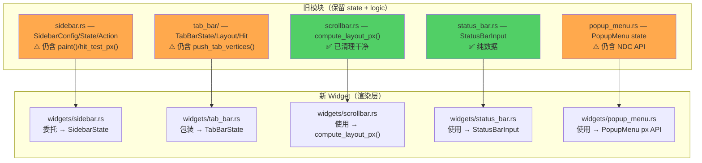
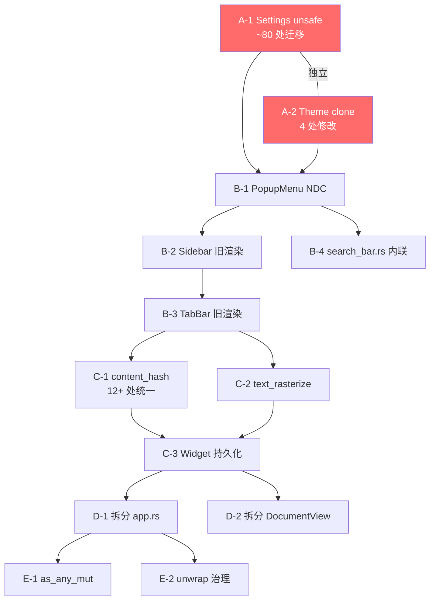

# UI 骨架审计修复实施计划

**关联审计**: [audit_ui_skeleton_2025_06_12.md](file:///Users/dan/proj/llmws/edit+/docs/audit_ui_skeleton_2025_06_12.md)  
**目标**: 解决审计中发现的安全、性能、架构、Bug 问题  
**原则**: 每个阶段独立可编译，原子化任务，接口先行

---

## 阶段总览


| 阶段 | 优先级 | 核心目标 | 预计改动文件数 |
|------|--------|----------|---------------|
| **A** | P0 | Settings unsafe 修复 + Theme 克隆消除 | ~15 |
| **B** | P1 | 清理旧 NDC 渲染函数 | 6-8 |
| **C** | P1 | 提取公共逻辑、优化每帧分配 | 5-8 |
| **D** | P2 | 拆分 app.rs 和 DocumentView | 4-6 |
| **E** | P3 | unwrap 治理 + 接口安全 | 多文件 |

---

## 阶段 A：安全 + 性能热点（P0）

> [!IMPORTANT]
> 本阶段修复两个最高风险问题。A-1 影响面最广（~80 处调用站），但改法机械，可安全执行。

### A-1. 修复 Settings `unsafe transmute`

**问题**: [settings.rs](file:///Users/dan/proj/llmws/edit+/crates/ui/src/settings.rs) L142-158 使用 `transmute` 将 `Ref<'_>` 扩展为 `Ref<'static>`，技术上 unsound。

**当前调用规模**:
- `Settings::get()` — **~80 处**（app crate ~60 处，ui crate ~20 处）
- `Settings::get_mut()` — **~8 处生产代码**（`app.rs` L249/298/1103/1236/2404，`events.rs` L439/449/459/469/478）

**调用模式分析**:

大多数调用是"读取 1-2 个字段"：
```rust
// 模式 1: 读取单字段（最常见，~50 处）
let lh = Settings::get().line_height();
let dpi = Settings::get().dpi_scale;

// 模式 2: 读取多字段（~20 处）
let s = Settings::get();
let font_size = s.font_size;
let line_height = s.line_height();

// 模式 3: 修改字段（~8 处）
Settings::get_mut().dpi_scale = new_scale;
```

**方案 — `with()` 闭包 + 便捷方法**:

```rust
impl Settings {
    /// 在闭包内安全访问 Settings
    pub fn with<R>(f: impl FnOnce(&Settings) -> R) -> R {
        SETTINGS.with(|s| f(&s.borrow()))
    }

    /// 在闭包内安全修改 Settings
    pub fn with_mut<R>(f: impl FnOnce(&mut Settings) -> R) -> R {
        SETTINGS.with(|s| f(&mut s.borrow_mut()))
    }
}
```

**分步执行**（每步独立可编译）:

**Step 1**: 添加 `with()` / `with_mut()`，标记 `get()` / `get_mut()` 为 `#[deprecated]`

**Step 2**: 迁移 ui crate 内调用（~20 处）：

| 文件 | 调用数 | 典型改法 |
|------|--------|---------|
| [popup_menu.rs](file:///Users/dan/proj/llmws/edit+/crates/ui/src/popup_menu.rs) | 2 | `Settings::get().dpi_scale` → `Settings::with(\|s\| s.dpi_scale)` |
| [sidebar.rs](file:///Users/dan/proj/llmws/edit+/crates/ui/src/sidebar.rs) | 12 | 同上 |
| [title_bar.rs](file:///Users/dan/proj/llmws/edit+/crates/ui/src/title_bar.rs) | 5 | 同上 |
| [tab_bar/state.rs](file:///Users/dan/proj/llmws/edit+/crates/ui/src/tab_bar/state.rs) | 1 | 同上 |
| [tab_bar/types.rs](file:///Users/dan/proj/llmws/edit+/crates/ui/src/tab_bar/types.rs) | 1 | 同上 |
| [widgets/*.rs](file:///Users/dan/proj/llmws/edit+/crates/ui/src/widgets) | ~5 | 同上 |

> [!NOTE]
> **架构问题**: UI crate 中有 ~20 处直接调用 `Settings::get().dpi_scale`，但 `LayoutCtx`、`PaintCtx`、`EventCtx` 已经携带了 `dpi: f32` 字段。理想情况下 UI Widget 应通过 Context 获取 dpi，而非直接访问全局 singleton。但这属于更大的重构，不在本阶段范围内——本阶段只消除 `unsafe`。

**Step 3**: 迁移 app crate 内调用（~60 处），按文件逐个处理：

| 文件 | 调用数 |
|------|--------|
| [app.rs](file:///Users/dan/proj/llmws/edit+/crates/app/src/app.rs) | ~32 (`get`) + ~5 (`get_mut`) |
| [app_renderer.rs](file:///Users/dan/proj/llmws/edit+/crates/app/src/app_renderer.rs) | ~25 |
| [events.rs](file:///Users/dan/proj/llmws/edit+/crates/app/src/events.rs) | ~13 (`get`) + ~5 (`get_mut`) |
| [render_pipeline.rs](file:///Users/dan/proj/llmws/edit+/crates/app/src/render_pipeline.rs) | ~8 |
| [commands.rs](file:///Users/dan/proj/llmws/edit+/crates/app/src/commands.rs) | ~6 |
| [document_view/mod.rs](file:///Users/dan/proj/llmws/edit+/crates/app/src/document_view/mod.rs) | ~5 |
| 其他 (`mouse.rs`, `cursor_motion.rs`, `workspace.rs`) | ~5 |

**Step 4**: 删除 `get()` / `get_mut()` 和 `unsafe` 块。确认 grep `transmute` 零结果。

**验证**:
```bash
cargo build --workspace
cargo test --workspace
grep -rn 'transmute' crates/ui/src/settings.rs   # 确认为零
grep -rn 'Settings::get()' crates/                # 确认为零
```

---

### A-2. 消除 Theme 每帧克隆

**问题**: `Theme` 在一帧内被 clone 4 次，其中 2 次在高频鼠标事件路径上。

**精确位置**:

| 文件 | 行号 | 代码 | 频率 |
|------|------|------|------|
| [app_renderer.rs](file:///Users/dan/proj/llmws/edit+/crates/app/src/app_renderer.rs) | L387 | `let theme = self.current_theme.clone();` | 每帧 1 次 |
| [app_renderer.rs](file:///Users/dan/proj/llmws/edit+/crates/app/src/app_renderer.rs) | L602 | `let theme = self.current_theme.clone();` | 每帧 1 次 |
| [events.rs](file:///Users/dan/proj/llmws/edit+/crates/app/src/events.rs) | L53 | `let theme = app.current_theme.clone();` | **每次鼠标点击** |
| [events.rs](file:///Users/dan/proj/llmws/edit+/crates/app/src/events.rs) | L114 | `let theme = app.current_theme.clone();` | **每次鼠标移动（>100Hz）** |

**注意**: `app_renderer.rs` 中已有 ~20 处通过 `&self.current_theme` 引用访问 Theme，说明引用传递在该文件中已是主流模式。

**操作**:
1. 将 4 处 `.clone()` 改为 `&self.current_theme` / `&app.current_theme`
2. 调整接收方函数签名：`theme: Theme` → `theme: &Theme`
3. 如果下游函数需要存储 Theme，改用 `Rc<Theme>` 或 `Arc<Theme>`

**验证**: 编译通过 + 运行 UI 确认渲染颜色正常 + 鼠标交互无异常

---

## 阶段 B：清理旧 NDC 渲染路径（P1）

> [!IMPORTANT]
> 关键发现：旧模块与新 Widget 是**分层包装**关系——旧模块提供 state/logic，新 Widget 提供 DrawCmd 渲染。真正需要删除的是旧模块中**残留的 NDC 渲染函数**和 app 层对它们的调用。

### 新旧代码真实关系图



---

### B-1. 删除 PopupMenu NDC API

**待删代码**: [popup_menu.rs](file:///Users/dan/proj/llmws/edit+/crates/ui/src/popup_menu.rs) L323-548

注释已标记 "Phase 8 末尾删"：
- L326-333: `PopupMenu::context()` — NDC 版（内部转调 `context_px`）
- L338-343: `PopupMenu::hit_test()` — NDC 版（内部转调 `hit_test_px`）
- L348-357: `hovered_item()` 独立函数
- L361-521: `popup_menu_vertices()` — 生成 NDC `GlyphVertex`
- L524-548: `popup_menu_text_positions()` — 生成 `TextFragment`

**App 层影响**:
- [events.rs](file:///Users/dan/proj/llmws/edit+/crates/app/src/events.rs) L354: 使用旧 `PopupMenu::context()` → 改为 `context_px()`
- [app_renderer.rs](file:///Users/dan/proj/llmws/edit+/crates/app/src/app_renderer.rs): 如有使用 `popup_menu_vertices()` → 改为 DrawCmd 路径

**操作**:
1. 将 `events.rs` 中 `PopupMenu::context()` → `PopupMenu::context_px()`
2. 将 `app_renderer.rs` 中 `popup_menu_vertices()` 调用替换为 `UiShell::paint_chrome()` 路径（确认 DrawCmd 路径已覆盖）
3. 删除 `popup_menu.rs` L323-548 区域
4. 删除相关 `use` 导入

**验证**: 编译通过 + 右键菜单、溢出菜单功能正常

---

### B-2. 清理 Sidebar 旧渲染残留

**当前状态**:
- `sidebar.rs` 中 `SidebarState` 仍包含 `paint()` 和 `hit_test_px()` 方法（L541-615）
- `widgets/sidebar.rs` 的 `Widget::paint()` 实现**内部调用 `self.state.paint()`**
- app 层 38 处引用 `ui::sidebar::*`（主要是 `SidebarConfig`, `Visibility`, `SidebarAction`, `SidebarKey`）

**分析**: `sidebar.rs` 的 `paint()` 被 `widgets/sidebar.rs` 委托调用，不是独立的旧路径。**不能直接删除**。

**真正需要清理的**:
1. `app_renderer.rs` 是否仍直接调用 `sidebar_panel_vertices()` / `sidebar_tabs_vertices()`（如果有的话）
2. `sidebar.rs` 中是否有已废弃但仍存在的 NDC 顶点生成函数

**操作**:
1. 检查 `app_renderer.rs` 中是否有对 `sidebar.rs` NDC 渲染函数的直接调用
2. 如果有，确认 DrawCmd 路径已覆盖后删除
3. 如果 `sidebar.rs` 的 `paint()` 仅被 `widgets/sidebar.rs` 调用，考虑将 paint 逻辑合并到 Widget 内

> [!WARNING]
> `sidebar.rs` 与 `widgets/sidebar.rs` 深度耦合（薄包装 + 大量委托），不能简单"删旧留新"。先确认调用关系后再动手。

**验证**: 编译通过 + 侧边栏全功能测试

---

### B-3. 清理 TabBar 旧渲染残留

**当前状态**:
- `tab_bar/render.rs` 中有 `push_tab_vertices()` 等 NDC 渲染函数
- `app_renderer.rs` 导入并调用这些函数
- `tab_infos` 在 `app_renderer.rs` 中构造两次（一次给 UiShell，一次给旧渲染）

**操作**:
1. 确认 `widgets/tab_bar.rs` + `UiShell` 的 DrawCmd 路径已替代旧渲染
2. 删除 `app_renderer.rs` 中 `push_tab_vertices` 调用 + 第二次 `tab_infos` 构造
3. 删除 `tab_bar/render.rs` 中的 NDC 渲染函数
4. **保留** `tab_bar/` 下的 `state.rs`, `layout.rs`, `hit.rs`, `types.rs`, `text.rs`, `tests.rs`

**验证**: 编译通过 + 标签栏渲染/切换/关闭/滚动正常

---

### B-4. 内联 search_bar.rs 常量

**当前**: [search_bar.rs](file:///Users/dan/proj/llmws/edit+/crates/ui/src/search_bar.rs) 仅 10 行，只剩 `SEARCH_BAR_HEIGHT = 28.0`。

**操作**:
1. 将 `SEARCH_BAR_HEIGHT` 移入 `widgets/search_bar.rs`
2. 在 `lib.rs` 中添加 re-export：`pub use widgets::search_bar::SEARCH_BAR_HEIGHT;`
3. 更新 `app.rs` 中的 `use ui::search_bar::SEARCH_BAR_HEIGHT` → `use ui::SEARCH_BAR_HEIGHT`（或直接路径）
4. 删除 `search_bar.rs` 文件
5. 从 `lib.rs` 移除 `pub mod search_bar`

**验证**: 编译通过

---

## 阶段 C：消除重复 + 优化每帧分配（P1）

### C-1. 提取公共 `content_hash` 函数

**问题**: content_hash 计算公式在 **12+ 处**完全重复。

**所有位置**:

| 文件 | 行号 | 上下文 |
|------|------|--------|
| [app.rs](file:///Users/dan/proj/llmws/edit+/crates/app/src/app.rs) | L501-507 | `init_display_map` skip check |
| [app.rs](file:///Users/dan/proj/llmws/edit+/crates/app/src/app.rs) | L609-615 | `init_display_map` pre_entries |
| [app.rs](file:///Users/dan/proj/llmws/edit+/crates/app/src/app.rs) | L644-650 | `init_display_map` placeholder entries |
| [app.rs](file:///Users/dan/proj/llmws/edit+/crates/app/src/app.rs) | L1553-1559 | `submit_reshape_ahead` check |
| [render_pipeline.rs](file:///Users/dan/proj/llmws/edit+/crates/app/src/render_pipeline.rs) | L233-236 | `shape_visible_lines` |
| [reshape_worker.rs](file:///Users/dan/proj/llmws/edit+/crates/app/src/reshape_worker.rs) | L167-170 | error 分支 1 |
| [reshape_worker.rs](file:///Users/dan/proj/llmws/edit+/crates/app/src/reshape_worker.rs) | L195-198 | error 分支 2 |
| [reshape_worker.rs](file:///Users/dan/proj/llmws/edit+/crates/app/src/reshape_worker.rs) | L221-224 | error 分支 3 |
| [reshape_worker.rs](file:///Users/dan/proj/llmws/edit+/crates/app/src/reshape_worker.rs) | L233-236 | error 分支 4 |
| [reshape_worker.rs](file:///Users/dan/proj/llmws/edit+/crates/app/src/reshape_worker.rs) | L271-274 | error 分支 5 |
| [reshape_worker.rs](file:///Users/dan/proj/llmws/edit+/crates/app/src/reshape_worker.rs) | L392-395 | error 分支 6 |

**公式**:
```rust
(byte_offset as u64)
    .wrapping_mul(31).wrapping_add(byte_length as u64)
    .wrapping_mul(31).wrapping_add(viewport_width.to_bits() as u64)
    .wrapping_mul(31).wrapping_add(font_size.to_bits() as u64)
```

**新增文件**: `crates/app/src/content_hash.rs`

```rust
/// 计算行内容哈希，用于增量渲染/reshape 缓存一致性检查。
///
/// 输入包含行的 byte_offset 和 byte_length（确定文本内容）
/// 以及 viewport_width 和 font_size（影响 word-wrap 结果）。
#[inline]
pub fn content_hash(
    byte_offset: usize,
    byte_length: u32,
    viewport_width: f32,
    font_size: f32,
) -> u64 {
    (byte_offset as u64)
        .wrapping_mul(31).wrapping_add(byte_length as u64)
        .wrapping_mul(31).wrapping_add(viewport_width.to_bits() as u64)
        .wrapping_mul(31).wrapping_add(font_size.to_bits() as u64)
}
```

**操作**:
1. 创建 `content_hash.rs`
2. 在 `lib.rs` 添加 `pub mod content_hash;`
3. 替换 12+ 处内联实现为 `content_hash::content_hash(byte_offset, byte_length, viewport_width, font_size)`

**验证**:
```bash
cargo build --workspace
cargo test --workspace
grep -rn 'wrapping_mul(31)' crates/app/   # 应仅剩 content_hash.rs 一处
```

---

### C-2. 提取公共 text rasterize 函数

**问题**: `shape → atlas lookup → rasterize → vertex push` 模式在渲染循环中重复。

**主要位置**: [render_pipeline.rs](file:///Users/dan/proj/llmws/edit+/crates/app/src/render_pipeline.rs) L718-764（内联在 `shape_visible_lines` 中）

**pattern**:
```rust
let slot = if let Some(cached) = text.atlas.get(&key) {
    *cached
} else {
    if let Some(bitmap) = text.shaper.rasterize_glyph(font_id, glyph_id, font_size) {
        if bitmap.width > 0 && bitmap.height > 0 {
            if let Some(slot) = text.atlas.insert(key, bitmap.width, bitmap.height, ...) {
                gpu.ctx.queue.write_texture(...);
                slot
            }
        }
    }
};
```

**新增文件**: `crates/app/src/text_rasterize.rs`

**接口设计**:
```rust
/// 查找或光栅化一个 glyph，返回 atlas slot。
/// 统一所有渲染路径的 glyph 处理逻辑。
pub fn resolve_glyph(
    key: GlyphKey,
    font_id: FontId,
    glyph_id: GlyphId,
    font_size: f32,
    shaper: &mut Shaper,
    atlas: &mut GlyphAtlas,
    queue: &wgpu::Queue,
    device: &wgpu::Device,
) -> Option<AtlasSlot> { ... }
```

**操作**:
1. 创建 `text_rasterize.rs`
2. 将 `render_pipeline.rs` L718-764 提取为 `resolve_glyph()`
3. `paint_backend.rs` 的 `emit_text()` 调用 `resolve_glyph()`
4. 确认 `app_renderer.rs` 是否有类似逻辑，如有则统一

**验证**: 编译通过 + 中英文混排渲染对比（位置、大小不变）

---

### C-3. 优化 UiShell 每帧 Widget 重建

**问题**: [ui_shell.rs](file:///Users/dan/proj/llmws/edit+/crates/app/src/ui_shell.rs) `update_frame()` L266 每帧 `self.dock.children.clear()` + 重新创建 6-7 个 `Box<dyn Widget>`。

**当前模式**（L266-365）:
```rust
pub fn update_frame(&mut self, ...) {
    self.dock.children.clear();  // ← 每帧销毁
    
    // 每帧重建 TabBar / SearchBar / StatusBar / Sidebar / Scrollbar / EditorHost
    if tabs_visible {
        let mut tb_w = TabBarWidget::new();  // ← 每帧 new + Box
        // ... set input ...
        self.dock.children.push(DockChild { ..., widget: Box::new(tb_w) });
    }
    // ... 其他 Widget 类似 ...
    
    self.dock.layout(screen_rect, &mut layout_ctx);
}
```

**持久化改造方案**:

**Step 1 — 将 Widget 提升为 UiShell 持久字段**:
```rust
pub struct UiShell {
    // 持久化 Widget 实例（不再每帧重建）
    tab_bar_widget: TabBarWidget,
    search_bar_widget: SearchBarWidget,
    status_bar_widget: StatusBarWidget,
    sidebar_widget: SidebarWidget,
    scrollbar_widget: ScrollbarWidget,
    editor_host_widget: EditorHostWidget,
    
    dock: Dock,
    dock_dirty: bool,  // 布局变化标记
}
```

**Step 2 — update_frame() 改为只更新输入**:
```rust
pub fn update_frame(&mut self, ...) {
    // 更新输入数据（无堆分配）
    self.tab_bar_widget.set_input(tab_input);
    self.status_bar_widget.set_input(status_input);
    self.scrollbar_widget.set_input(scroll_input);
    // ...
    
    // 仅在结构变化时重建 Dock children 列表
    if self.dock_dirty {
        self.rebuild_dock();
        self.dock_dirty = false;
    }
    
    self.dock.layout(screen_rect, &mut layout_ctx);
}
```

**触发 `dock_dirty = true` 的条件**:
- `ViewMode` 切换（Sidebar ↔ Tabs）
- SearchBar 显示/隐藏
- 窗口首次创建

> [!WARNING]
> **需要先评估 Dock 接口**：当前 `Dock::children` 是 `Vec<DockChild>`，其中 `DockChild.widget` 类型为 `Box<dyn Widget>`。持久化方案需要 Dock 支持以下之一：
> 
> **选项 A**: Dock 改用 `&mut dyn Widget` 引用（需改 Dock API）
> **选项 B**: 保持 `Box<dyn Widget>` 但使用 `std::mem::replace` 复用实例
> **选项 C**: 不改 Dock，只在 `dock_dirty` 时重建（最小改动）
> 
> 建议采用 **选项 C**，仅在布局结构变化时重建 Dock children，其他帧直接 reuse。

**验证**: 编译通过 + `dock_dirty` 仅在模式切换时触发（添加 debug log 确认）

---

## 阶段 D：拆分巨型结构（P2）

### D-1. 拆分 app.rs（3625 行 / 151KB）

**当前结构**:

| 区域 | 行范围 | 内容 | 预计行数 |
|------|--------|------|---------|
| imports + App struct | L1-151 | 结构体定义 | 150 |
| `impl App` (主体) | L153-1675 | new(), init_display_map(), 核心方法 | 1522 |
| `impl App` (续) | L1677-2210 | handle_scroll 等交互方法 | 533 |
| `impl ApplicationHandler` | L2212-3625 | winit 事件循环 | 1413 |

**注意**: app 层已有良好的文件分离（`app_renderer.rs`, `commands.rs`, `events.rs`, `render_pipeline.rs`），都是独立 `impl App` 块。app.rs 的进一步拆分是**锦上添花**。

**拆分方案**:

| 新文件 | 提取内容 | 行数 |
|--------|----------|------|
| `app_lifecycle.rs` | `impl ApplicationHandler<AppEvent> for App`（L2212-3625） | ~1400 |
| `app_init.rs` | `App::new()` + GPU 初始化 + `init_display_map()`（L153-700 区域） | ~550 |

拆分后 `app.rs` 降至 ~1700 行（App struct + 核心方法），可维护性显著提升。

**操作**:
1. 创建 `app_lifecycle.rs`，将 `impl ApplicationHandler<AppEvent> for App` 整体剪切过去
2. 创建 `app_init.rs`，将 `App::new()` 和 `init_display_map()` 剪切过去
3. 在 `lib.rs` 添加 `mod app_lifecycle; mod app_init;`
4. 处理 import 和 visibility（可能需要将部分 App 方法改为 `pub(crate)`）

**验证**: 编译通过 + 应用正常启动

---

### D-2. 拆分 DocumentView（渐进式）

**当前**: `DocumentView` 有 80+ 字段，`pub(crate)` 暴露。

**分 3 个 PR 推进**（每个独立可编译）:

**PR 1 — 提取 `CursorState`**:
```rust
// document_view/cursor.rs (新)
pub(crate) struct CursorState {
    pub line: usize,
    pub col: usize,
    pub byte_offset: usize,
    pub preferred_col: Option<usize>,
    pub selections: Vec<Selection>,
}
```
- DocumentView 新增 `cursor: CursorState` 字段
- 提供 `cursor(&self)` / `cursor_mut(&mut self)` 访问
- 逐步将 `doc_view.cursor_line` → `doc_view.cursor().line`

**PR 2 — 提取 `DisplayState`**:
```rust
// document_view/display.rs (新)
pub(crate) struct DisplayState {
    pub viewport: Viewport,
    pub display_line_map: DisplayLineMap,
    pub render_cache: RenderCache,
}
```

**PR 3 — 提取 `SearchState`**（已有 `search_state.rs`，确认完全委托）

> [!WARNING]
> 改动面广——`commands.rs`, `events.rs`, `cursor_motion.rs`, `render_pipeline.rs` 等都直接访问 DocumentView 字段。建议用编译器错误驱动迁移：先改 struct 定义，然后逐个修复编译错误。

**验证**: 每个 PR 编译通过 + 全部测试通过

---

## 阶段 E：代码健壮性（P3）

### E-1. 修复 `as_any_mut` 默认 panic

**位置**: [widget.rs](file:///Users/dan/proj/llmws/edit+/crates/ui/src/core/widget.rs) L105-107

```rust
fn as_any_mut(&mut self) -> &mut dyn Any { unimplemented!(...) }
```

**影响**: 5 处调用站（`ui_shell.rs` 4 处, `events.rs` 1 处），用于 downcast 到具体 Widget。当前所有 9 个 Widget 实现都已 override，不会触发 panic。

**操作**: 删除默认实现，改为 required method：
```diff
- fn as_any_mut(&mut self) -> &mut dyn Any { unimplemented!(...) }
+ fn as_any_mut(&mut self) -> &mut dyn Any;
```

这样忘记实现时**编译期报错**，而非运行时 panic。

**验证**: 编译通过（所有 9 个 Widget 已有实现）

---

### E-2. 治理生产代码高危 unwrap

**高危 unwrap**:

| 位置 | 代码 | 风险 | 修复方案 |
|------|------|------|---------|
| `app.rs:1273` | `self.gpu.as_ref().unwrap()` | GPU 未初始化 panic | `if let Some(gpu) = &self.gpu { ... } else { return; }` |
| `cursor_motion.rs:190` | `advance_cache.last().unwrap()` | 空缓存 panic | `let Some(last) = cache.last() else { return default_pos; };` |

**操作**:
1. 逐个将运行时 panic 改为 early return 或 fallback
2. **保留** `expect()` 用于不可恢复的初始化错误（如 `"FontSystem not initialized"`）
3. **不动** 测试代码中的 `unwrap()`

**验证**: 编译通过 + 故意模拟 GPU 未初始化场景确认不 panic

---

## 验证计划

### 每阶段自动化测试

```bash
cargo build --workspace
cargo test --workspace
cargo clippy --workspace -- -D warnings
```

### 每阶段手动冒烟测试

- [ ] 应用正常启动，无 panic
- [ ] 标签栏：创建、切换、关闭、滚动、右键菜单
- [ ] 侧边栏：显示/隐藏/hover peek/拖拽调整宽度/设置菜单
- [ ] 搜索栏：打开/关闭/输入/匹配导航
- [ ] 滚动条：拖拽 thumb、点击 track、鼠标滚轮
- [ ] 状态栏：光标位置、文件信息正确
- [ ] 大文件（>10K 行）：打开后滚动流畅

---

## 依赖关系与并行度



- **A-1 和 A-2 互相独立**，可并行
- **B-1 → B-2 → B-3 顺序执行**（每删一个旧路径可能暴露其他依赖）
- **B-4 独立**，可与 B-1 并行
- **C-1 和 C-2 独立**，可并行
- **C-3 依赖 C-1/C-2**（减少改动冲突）
- **D-1 和 D-2 独立**，可并行
- **E-1 和 E-2 独立**，可并行
